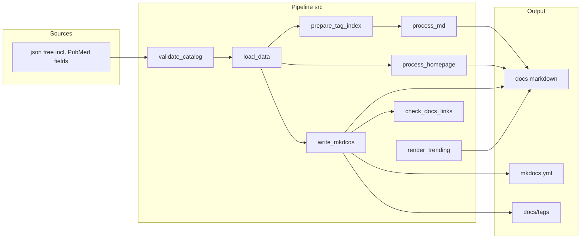

# CTGCatalog — design overview

**On this page:** [Purpose](#purpose) · [Layout](#repository-layout-high-level) · [Data flow](#data-flow) · [Topology](#catalog-topology) · [Authoring](#authoring-new-json-entries) · [Tags](#tags-and-badges-mkdocs-material) · [UX](#markdown-and-ux-conventions) · [Build](#local-build--deploy) · [Extensions](#extension-points)

## Purpose

**CTGCatalog** ([Complex Trait Genetics Catalog](https://cloufield.github.io/CTGCatalog/)) is a manually curated index of resources for complex trait genetics: reference databases, public summary statistics, software tools, biobanks, single-cell methods, and related topics (e.g. **AI**, **Projects**, **Journals**). The published site is a static MkDocs build with Material-style navigation; page bodies are generated Markdown under `docs/`.

This file explains **how JSON becomes the site** (pipeline, paths, tags, build). **Field names, routing rules, and JSON shape** are in [SCHEMA.md](./SCHEMA.md); **machine validation** is [catalog-entry.schema.json](./catalog-entry.schema.json) (enforced via `src/validate_catalog.py`).

Editorial criteria for what belongs in the catalog are out of scope here.

## Repository layout (high level)

| Area | Role |
|------|------|
| `json/` | **Source of truth** — one UTF-8 JSON object per catalog entry file, grouped by `SECTION` / `TOPIC` / `SUBTOPIC` in the directory tree. |
| `json/tags/` | **Not catalog rows** — tag registry (e.g. `valid-tags.json`) for a curated vocabulary; excluded by `catalog_sources.is_catalog_json_file()`. |
| `json/projects/<name>/` | One subfolder per program; each `*.json` file is one phase (card) on that program’s page. |
| `json/journals/` | One JSON per venue; synced with `sync_journals_from_catalog.py`. |
| `.design/` | Human docs (`DESIGN.md`, `SCHEMA.md`) plus `catalog-entry.schema.json`. |
| `src/` | Python pipeline: validate → load JSON → tag index → format → emit `docs/*.md` and `mkdocs.yml`. PubMed enrichment lives in JSON (`sync_json_bibliography.py`). |
| `scripts/` | CLI helpers: `validate_catalog_schema.py`, `minify_extra_css.py`, `render_trending_pubmed_gwas.py`, biobank map utilities, etc. |
| `docs/` | Generated Markdown (and hand-maintained static assets). `deploy.sh` removes `docs/*.md` before a full regen. |
| `docs/overrides/` | MkDocs Material `custom_dir` templates (e.g. `main.html` appends `class` from page front matter for scoped CSS). |
| `ranking/` | Input CSVs for the optional PubMed GWAS trending page (see `scripts/render_trending_pubmed_gwas.py`). |
| `.cache/pubmed/` | Local Entrez efetch XML cache (gitignored); optional. |
| `mkdocs.yml` | **Regenerated** by `process_mkdocs.write_mkdcos()` (spelled that way in code) — static header in `process_mkdocs.py` plus dynamic `nav` from the loaded table. |

## Data flow

1. **`validate_catalog.validate_catalog()`** — every catalog JSON under `json/` (excluding non-catalog trees such as `json/tags/`) is checked with **jsonschema** against `.design/catalog-entry.schema.json`. On failure, `main.py` exits before generation.
2. **`load_data.load_table_and_ref()`** walks `json/**/*.json`, parses each object into a row, strips `_meta`, and sets `FIELD` from `_meta.source_sheet` when present. It normalizes `SECTION` / `TOPIC` / `SUBTOPIC` (spaces and hyphens → underscores), normalizes `PMID` to string digits, derives `FIRST_AUTHOR` from `Authors` when missing (does **not** synthesize `CITATION`—that stays explicit in JSON or via `MANUAL_CITATION` in `format_table`), and writes `not_in_lib.pmidlist` for PMIDs without bibliography and without `MANUAL_CITATION`.
3. **`tag_pages.prepare_tag_index()`** builds per-tag buckets, a stable **slug map** (`catalog_sources.assign_tag_slugs`), and card-row data for tag listing pages. While `process_md.write_md()` runs, `print_level.TAG_SLUG_MAP` is set so entry-card badges can link to `docs/tags/<slug>/`.
4. **`format_table.format_main()`** enriches rows: journal lines, PubMed links, URL markdown, optional name prefix/suffix rules, related-biobank links (uses `load_biobanks()` on `json/biobanks/**`).
5. **`process_md.write_md()`** groups rows by output path `../docs/{SECTION}_{TOPIC}_{SUBTOPIC}.md` (empty segments omitted), writes summary tables and per-entry detail blocks via `print_level.write_markdown()`.
6. **`process_homepage.write_homepage()`** writes `docs/index.md` and `docs/Catalog_statistics.md`.
7. **`process_mkdocs.write_mkdcos()`** reloads the table, writes **section hub** pages `docs/{SECTION}.md` (“Contents - …” lists; Biobanks hub embeds the world-map snippet from `src/templates/biobanks_world_map.html`), emits **`docs/tags/index.md`** and **`docs/tags/<slug>.md`** via `tag_pages.write_tag_pages()`, and overwrites repo-root **`mkdocs.yml`** `nav` (fixed tab order in code; see [Catalog topology](#catalog-topology)).
8. **`main.py` → `_emit_trending_pages()`** runs `scripts/render_trending_pubmed_gwas.py` from the repo root (falls back to `--stub` if primary data are missing) so `docs/Trending/` URLs exist; the same script is invoked again from `deploy.sh` after the build.
9. **`check_docs_links.run_link_check()`** — internal link pass over generated docs; failures exit `main.py` non-zero.

**Entry point:** `src/main.py` (run from `src/`, as in `deploy.sh`). Requires **jsonschema** (see `requirements-dev.txt`).

## Catalog topology

- **`SECTION`** maps to a top-level site area. Tabs follow **`_NAV_TAB_ORDER`** in `process_mkdocs.py`: **Biobanks**, **Sumstats**, **Tools** (nav label **GWAS Tools**; hub file remains `Tools.md`), **Coding**, **Population Genetics**, **References**, **Single_Cell**, **Projects**, **AI**.
- **Journals**, **Catalog statistics**, and **Trending** are **not** top tabs: Journals still get Markdown from the pipeline but are linked from the home page; Trending pages are listed under `mkdocs.yml` `not_in_nav` so they build without appearing in the tab bar.
- Rows with **`SECTION=Tools`** and **`TOPIC=Population_Genetics`** are split into a separate **Population Genetics** tab and hub (`Population_Genetics.md`); underlying page filenames stay `Tools_Population_Genetics_*.md`.
- **`TOPIC`** and optional **`SUBTOPIC`** define nested nav under that section and the Markdown filename stem: `{SECTION}_{TOPIC}_{SUBTOPIC}.md`.
- **`NAME`** is the display title and anchor slug input (via `format_table.fix_name_link()`).

`src/catalog_sources.py` defines **`HOMEPAGE_SUMSTATS_SHEETS`**: `FIELD` values (from `_meta.source_sheet`) that are counted in the Sumstats block on `Catalog_statistics.md` (`Sumstats`, `Proteomics`, `Transcriptomics`, `Epigenetics`, `SV`, `Imaging`, `Gut_microbiome`).

## Authoring new JSON entries

- Place one catalog `.json` file per entry under `json/<section>/…` matching your routing. Use `catalog_sources.slugify_segment()` (or the same rules: lowercase, spaces to hyphens, strip unsafe characters) for directory and filename segments if you want consistency with existing paths.
- **Do not** put catalog entries under `json/tags/`; that tree is for registries only.
- Duplicate display names in the same folder need distinct filenames (e.g. `tool.json`, `tool_2.json`).
- Set `_meta.source_sheet` to a stable label if the entry should be included in homepage sumstats statistics (must match an entry in `HOMEPAGE_SUMSTATS_SHEETS` when applicable) or for traceability.

See [SCHEMA.md](./SCHEMA.md) for field names, routing details, and examples.

## Tags and badges (MkDocs Material)

Tags drive **Material’s tag index / search filters** and the **pill labels** on each entry card. Both are derived from the same per-row list in `print_level._badges_for_row()`.

**Design intent:** Tags should encode **key features** of an entry—especially for **Tools**, where several similar methods often share the same topic or subsection. Choose tags that help readers **tell tools apart at a glance** (e.g. method family, modality, scale, implementation) rather than restating only what the section nav already conveys.

### Tag vocabulary

`json/tags/valid-tags.json` is a **curated list** of allowed tag strings and short descriptions for authors. It is **not** enforced automatically by the build; keeping new tags aligned with that file avoids drift and duplicate spellings.

### JSON fields

| Field | Role |
|-------|------|
| **`TAGS`** | Preferred. JSON array of strings, or one string (use `;` to separate multiple tags). |
| **`TAG`** | Single tag, or `;`-separated list (same parsing as `TAGS`). |
| **`BADGES` / `BADGE`** | Legacy aliases; used only if `TAG` and `TAGS` are absent or empty. |

`TAG` / `TAGS` / `BADGE` / `BADGES` are **not** repeated in the card body—only in the header badges and in page metadata.

### Resolution order (per row)

1. `TAGS` → if present and non-empty after parsing, use it.  
2. Else `TAG`.  
3. Else `BADGES` / `BADGE`.  
4. Else **section default** from `print_level._SECTION_DEFAULT_BADGES` (e.g. `Tools` → `"Tool"`).  
5. Else a fallback label derived from `SECTION`.

### Page-level vs card-level

- **Card header:** each entry’s badges are exactly `_badges_for_row(that_row)` (`print_level._write_entry_card`).
- **Page front matter:** `process_md._collect_unique_page_tags()` builds the **sorted union** of tags across all rows on that Markdown page. Filters show every tag used by any entry on the page, not only one entry.
- **Tag index:** `docs/tags/index.md` lists every tag in use; each `docs/tags/<slug>.md` page aggregates links and optional full cards for entries sharing that tag (`tag_pages.write_tag_pages`).

### Duplicate `NAME` / multiple JSON files

One **logical** tool may appear in **several** `.json` files (e.g. different `CATEGORY`, or `name.json` + `name_2.json`). Each file is a **separate row**: tags are **not** copied between files. Set `TAG` / `TAGS` on **every** file if you want the same badges everywhere.

Duplicate display names also produce **duplicate HTML `id` attributes** on headings (anchor = slug of `NAME`). Prefer distinct `NAME` text or accept that `#slug` links target the first matching heading.

### Code reference

- `src/print_level.py` — `_parse_badges_cell`, `_badges_for_row`, skipping tag columns in the card field loop; `TAG_SLUG_MAP` for badge → tag-page links during `write_md`.  
- `src/process_md.py` — `_collect_unique_page_tags`, `_write_page_front_matter` (`tags` + `hide: tags`).
- `src/tag_pages.py` — `prepare_tag_index`, `write_tag_pages`, `collect_tag_page_data`.

## Markdown and UX conventions

- Summary tables use GitHub-flavored pipe tables; long `CITATION` / `TITLE` cells are truncated for the summary only (`process_md`).
- Detail sections render selected columns as cards; see **[Tags and badges](#tags-and-badges-mkdocs-material)** above.
- Biobank entries under `json/biobanks/` are also loaded for resolving `RELATED_BIOBANK` links in sumstats rows.

## Local build / deploy

- From the **repository root**, `deploy.sh` removes `./docs/*.md`, runs `python ./main.py` from `src/`, runs `scripts/render_trending_pubmed_gwas.py` again (or `--stub`) so trending output matches the latest `ranking/` data, runs `scripts/minify_extra_css.py` after CSS edits, then serves with Zensical (commented alternative: `mkdocs gh-deploy`).
- Refresh PubMed metadata in JSON with `python sync_json_bibliography.py` from `src/`. Regenerate `json/journals/*.json` with `python sync_journals_from_catalog.py`.

## Extension points

- **New catalog fields:** add keys to JSON objects; the loader uses a wide DataFrame—downstream code only touches fields it knows about. Update [SCHEMA.md](./SCHEMA.md) and, if the shape should be validated, [catalog-entry.schema.json](./catalog-entry.schema.json).
- **New sections:** ensure `SECTION` / `TOPIC` / `SUBTOPIC` values produce the desired `PATH`; `write_mkdcos()` derives nav from unique folder combinations and may need `_NAV_TAB_ORDER` / special cases (e.g. Journals-only, Tools↔Population Genetics split) if the section should not behave like a default tab.
- **Tags:** extend [Tags and badges](#tags-and-badges-mkdocs-material) and `json/tags/valid-tags.json`; to change section-wide defaults, edit `print_level._SECTION_DEFAULT_BADGES`. Tag listing URLs are regenerated under `docs/tags/` on each build.
- **Section hub copy / ordering:** edit `_SECTION_HUB_LEADS` and `_NAV_TAB_ORDER` in `process_mkdocs.py` (remember `part1` / static `mkdocs.yml` fragments live in the same module).
- **Trending:** extend `scripts/render_trending_pubmed_gwas.py` and inputs under `ranking/`; keep `not_in_nav` in `part1` aligned if paths change.
- **Validation / links:** from the repo root, `python3 scripts/validate_catalog_schema.py` runs the same schema check as `main.py`; internal links are checked in `src/check_docs_links.py` after generation.

For the JSON object shape and full field reference, see [SCHEMA.md](./SCHEMA.md).
